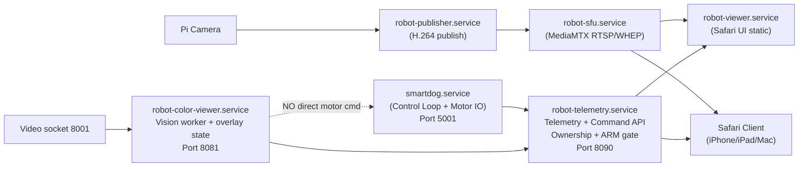

# Next Development Proposal
# file:///Users/mengtatsai/Freenove_Robot_Dog_Kit_for_Raspberry_Pi/Code/NEXT_DEVELOPMENT_PROPOSAL.md
## Version
v1.51 (2026-02-12 09:54 local time)

## Revision History
- 2026-02-12 09:54 v1.51  Added live-UX hardening and detector-policy update: dual-model flow changed to `best`-first with `yolov8n` fallback on no-target, stale-target overlay suppression, stream-stall/YOLO-error warning overlays, and metrics infer-model source visibility (`Infer (ms) "best|yolov8n" model`).
- 2026-02-12 09:14 v1.50  Added live Safari-driven optimization update: model-aware overlay labels (`MT_ball`/`Yolo_sport ball`), metrics-pane visibility adjustment (`infer_ms` moved upward), and new Pi performance candidate (`best_256_fp16.tflite`) validated with improved inference latency.
- 2026-02-12 08:03 v1.49  Implemented Pi `tflite-multi` round-robin backend for comma-separated model paths (`best` + `yolov8n`), deployed `color_viewer_server.py` `2026.02.12-34`, and captured new active-heartbeat target/light benchmark metrics showing detector functionality restored but CPU saturation still blocking KPI pass.
- 2026-02-11 22:02 v1.48  Added latest Pi execution update: implemented TFLite-ready backend path in `color_viewer_server.py`, fixed benchmark `/vision/metrics` parser for real client-heartbeat FPS capture, validated baseline/target KPI runs with active heartbeat, and documented remaining blocker (no working `best.pt`/`yolov8n.pt` detector runtime on Bullseye armv7 OpenCV 4.5.1).
- 2026-02-11 19:38 v1.47  Implemented/verified `Server/phaseD_benchmark_1hz.sh` (tiered 1Hz KPI harness + PASS/WARN/FAIL summary), integrated onnxruntime-first backend selection in `color_viewer_server.py`, and recorded latest Pi benchmark outcomes plus current deployment blocker.
- 2026-02-11 18:26 v1.46  Added Pi-appliance A/B/C execution blueprint: clean Pi-first runtime architecture with strict vision-control boundaries, 1Hz CPU/thermal benchmark plan with pass/fail gates, and deterministic vision resource governor state machine plus prioritized task list with feasibility assessment.
- 2026-02-11 18:19 v1.45  Advanced D-Phase-A to Pi runtime validation: installed Pi OpenCV dependency, added ONNX fallback backend in worker, exported/deployed `best.onnx`, and recorded current blocker (`OpenCV 4.5.1` ONNX parser incompatibility on this model graph) with temporary YOLO-off rollback.
- 2026-02-11 17:55 v1.44  Added execution status note for detector-worker rollout: integration is complete, but live inference on Pi is currently blocked by missing runtime dependencies (`numpy`/`opencv` in service Python environment).
- 2026-02-11 17:49 v1.43  Implemented D-Phase-A full detector worker integration in Pi color-viewer runtime: frame ingest from `8001`, YOLO inference loop (`imgsz` + interval `N`), live target publication to `/vision/state`, and browser overlay/health metrics wiring.
- 2026-02-11 17:20 v1.42  Added explicit freshness checkpoint revision so operators can quickly confirm this is the latest proposal snapshot in editor tabs.
- 2026-02-11 16:57 v1.41  Renamed Pi-hosted color viewer runtime entry from `Demo_IMU_server.py` to `color_viewer_server.py` and aligned launcher/service references to reduce demo/prod naming confusion.
- 2026-02-11 14:57 v1.40  Started D-Phase-A runtime integration on Pi color-viewer: added `/vision/state` toggle/state schema path and wired Yolo/Tracking UI controls to runtime config/state (no actuation coupling).
- 2026-02-11 14:39 v1.39  Added explicit “target-and-adjust” execution loop for Vision work: hold WebRTC KPI as fixed target, then iteratively tune YOLO (`imgsz`, `N`) based on measured results each run.
- 2026-02-11 14:37 v1.38  Added explicit performance policy: prioritize WebRTC/SFU stream quality (`960x540`, `>20fps`, low latency) and run YOLO under constrained profile (`low imgsz` + interval `N`) to avoid Pi overload.
- 2026-02-11 14:34 v1.37  Added explicit immediate-next-step checklist for D-Phase-A preparation (benchmark + telemetry schema + overlay stub), including measurable outputs and pass/fail gates.
- 2026-02-11 14:26 v1.36  Updated current execution status (Demo stop behavior + one-shot stability note), and expanded YOLO/Tracking implementation plan with concrete architecture, verification matrix, and technical risk assessment for Pi 4B constraints.
- 2026-02-11 12:20 v1.35  Added Phase-B progress update for wired `Horizon` + `Demo` action path (`/demo` one-shot via `Server/Action.py`), recorded Pi test result, and expanded Work Package D into concrete YOLO+Tracking implementation milestones.
- 2026-02-11 11:21 v1.34  Executed Pi-only color-viewer rollout: deployed `Client/tools/imu_viewer` bundle to Pi `Server/color_viewer`, created/enabled `robot-color-viewer.service` on port `8081`, and verified Pi-hosted `/color` + `/video/status` without Mac runtime dependency.
- 2026-02-11 11:12 v1.33  Added explicit next-stage target to run viewer stack purely on Pi Server (no Mac dependency) with browser-only validation on Safari/Chrome and migration checkpoint in immediate next steps.
- 2026-02-10 19:10 v1.32  Added color IMU polish progress: visible build badge plus persistent orientation tuning controls (invert/offset/reset) in `index_color.html`/`app_color.js`.
- 2026-02-10 18:56 v1.31  Added implementation detail for color 3D dog overlay in live video (bottom-left), compact IMU line, and stale-alert behavior (red IMU text + greyscale model after >1s interruption).
- 2026-02-10 18:42 v1.30  Added explicit IMU yaw-improvement roadmap: Phase-1 client-side yaw unwrapping/rate guard and Phase-2 Pi-side continuous-yaw + real-dt fusion hardening.
- 2026-02-10 07:42 v1.29  Ran remote precheck on Pi and recorded concrete blockers (Tailscale not installed; WAN profile missing TLS + TURN/STUN settings).
- 2026-02-10 07:40 v1.28  Added concrete remote-access artifacts: `REMOTE_SAFARI_ACCESS_RUNBOOK.md` and `phaseE_remote_precheck.sh`; moved outside-home Safari item to in-progress (design/runbook stage).
- 2026-02-10 07:35 v1.27  Verified deployed balance toggle actions on Pi API (`balance_on`/`balance_off`) and refreshed live soak progress snapshot.
- 2026-02-10 07:33 v1.26  Extended mobile parity wiring: added `Balance` toggle action path (`balance_on`/`balance_off`) with ARM/session enforcement.
- 2026-02-10 07:32 v1.25  Deployed/validated low-risk actions (`beep`, `led`, `cal`) on Pi telemetry API service and recorded verified command-path status.
- 2026-02-10 07:30 v1.24  Progressed UI parity backlog by wiring low-risk actions (`Beep`, `LED`, `Cal`) into mobile command path with existing ARM/session safety gate.
- 2026-02-10 07:27 v1.23  Added execution update: Safari IMU 3D enhancements (smoothing/axis-scale/stale-freeze controls) and refreshed live soak-status snapshot.
- 2026-02-10 07:19 v1.22  Expanded plan into detailed execution blueprint with work packages, verification gates, rollout/rollback, and updated immediate next steps from current state.
- 2026-02-10 07:14 v1.21  Added low-priority follow-on plan for iPhone Safari remote access outside home LAN (auth/TLS/TURN/reverse-tunnel gate).
- 2026-02-10 07:11 v1.20  Added Safari simple 3D IMU model implementation item (CSS cube in Pi viewer) and marked wishlist 3D status as implemented baseline.
- 2026-02-09 21:31 v1.19  Advanced wishlist execution: added mtDogMain IMU web quick-launch/status, marked 3D IMU animation as delivered via IMU viewer assets, and moved mobile UI-parity placeholders into Pi web viewer.
- 2026-02-09 21:23 v1.18  Captured completed failure-injection results (publisher/SFU interruption recovery) and noted 24h soak resumed after drill.
- 2026-02-09 21:20 v1.17  Added explicit Phase-5 failure-injection execution item with new drill script (`phase5_failure_injection.sh`).
- 2026-02-09 21:01 v1.16  Started 24h soak probe in background on Pi and recorded monitoring/log path for deferred review.
- 2026-02-09 20:56 v1.15  Added hardening progress: optional API bearer-token gate implemented/verified and concrete pre-WAN checklist document added.
- 2026-02-09 20:50 v1.14  Added Phase-5 verification progress: restart drill passed with RTSP warm-up retry and 3-minute soak probe passed (31 rounds, 0 fails).
- 2026-02-09 20:44 v1.13  Added Phase-5 execution note: restart-drill/soak scripts prepared, but Pi became unreachable (host down) before deployment verification could complete.
- 2026-02-09 18:58 v1.12  Marked Phase-5 as in-progress and recorded implemented observability/startup/cache-control items with pending soak/hardening gates.
- 2026-02-09 18:48 v1.11  Marked Phase-4 as done with control-lock visibility, request/release handoff workflow, and explicit `CMD_BUSY#OWNER` messaging.
- 2026-02-09 18:42 v1.10  Added low-priority mobile UI parity backlog: mtDogMain-style motion-key layout and placeholder controls/sliders for future implementation.
- 2026-02-09 18:25 v1.9  Marked Phase-3 command MVP as done with delivered endpoints/UI/safety controls and shifted next focus to Phase-4 session UX.
- 2026-02-09 17:59 v1.8  Added prioritized execution item: implement hop-by-hop validation checklist now; define auth/TLS/TURN hardening plan as mandatory pre-WAN gate.
- 2026-02-09 17:20 v1.7  Added explicit status markers for all phases (Done/Not started) for roadmap tracking.
- 2026-02-09 17:18 v1.6  Added plan progress stamps (`Done YYYY-MM-DD HH:MM`) for completed phases.
- 2026-02-09 17:14 v1.5  Added future wishlist items for Mac `mtDogMain.py` IMU viewer activation and optional 3D dog animation driven by live IMU.
- 2026-02-09 14:24 v1.4  Added follow-on development target for Pi 4B minimal YOLO object detection + tracking after mobile video/server milestone.
- 2026-02-09 14:16 v1.3  Added design-for-testability feature requirements and mandatory verification gate with intervention escalation.
- 2026-02-09 13:03 v1.2  Added explicit host mapping note that `192.168.0.198` is the Client MacBook Pro M5.
- 2026-02-09 12:54 v1.1  Added quantitative acceptance criteria, API contract appendix, safety state machine, ownership lease semantics, and rollback/test hardening details.
- 2026-02-09 12:26 v1.0  Initial complete phased proposal for Pi-standalone video + iOS interactive control roadmap.

## Context
Current prototype behavior:
- Pi provides control/telemetry server (`5001`) and legacy video (`8001`).
- Pi publisher sends H.264 stream to SFU path `robotdog` via RTSP.
- SFU + web viewer host are on `192.168.0.198`.
- `mtDogMain.py` uses RTSP pull; Safari viewer uses WebRTC/WHEP.

Current issue:
- iPhone/iPad viewing depends on `192.168.0.198` being online.
- Desired direction is standalone service with clearer product path to mobile interaction.

Host mapping note (current environment):
- `192.168.0.32` = Raspberry Pi Server (robot control + publisher)
- `192.168.0.198` = Client MacBook Pro M5 (current SFU + web viewer host)

## Latest Pi Validation (2026-02-12 09:14)
- Runtime:
  - `robot-color-viewer.service` active with version `2026.02.12-38`.
  - safety rollback enforced after testing: `yolo_enabled=false`, `tracking_enabled=false`.
- Backend path work completed:
  - enabled multi-model TFLite loading for comma-separated model path and round-robin per-inference scheduling (`tflite-multi`).
  - kept detector frame fallback `8001 -> rtsp://<pi>:8554/robotdog` for stream continuity.
  - added runtime model-aware label mapping for overlay readability:
    - `best*` source -> `MT_ball`
    - `yolov8n/yolo11n*` source -> `Yolo_sport ball`
  - added hot-reload for `yolo_model_path` so model/profile switches apply without manual service restart.
- UI/readability update:
  - moved `Infer (ms)` near top of `Vision/Stream Metrics` pane in `/color` for no-scroll visibility.
- Measured runs with active heartbeat:
  - target 45 samples: `/tmp/phaseD_benchmark_target_rrmulti_20260212_075719.json` -> `stream_fps_client_p95=22.5`, `det_fps_avg=0.230`, `infer_ms_avg=3027`, `cpu_p95=97.3` (FAIL: `cpu_p95>90`)
  - light 45 samples: `/tmp/phaseD_benchmark_light_rrmulti_20260212_080006.json` -> `stream_fps_client_p95=22.5`, `det_fps_avg=0.241`, `infer_ms_avg=2789`, `cpu_p95=97.6` (FAIL: `cpu_p95>90`)
- Current hard blocker:
  - detector is now functional on Pi (`tflite-multi+rtsp`) but `best_320_fp16.tflite` + `yolov8n_320_fp16.tflite` still saturate Pi CPU at current cadence, so KPI gate fails despite stable client stream heartbeat.
- New optimization candidate validated (live Safari):
  - model: `best_256_fp16.tflite`
  - config: `imgsz=256`, `interval_n=8`, `conf_threshold=0.05`
  - result sample: `infer_ms_avg=1487.9`, `det_fps_avg=0.237`, `target_ratio=0.917`, class histogram dominated by `MT_ball`.

## Product Goal
Deliver a robust iPhone/iPad Safari experience that supports:
- low-latency live video
- live telemetry overlay
- selected safe robot commands

And reduce infrastructure dependency by moving toward always-on hosting.

## Scope And Principles
In scope:
- Pi-first deployment option (standalone or near-standalone)
- Safari-first web control UI
- safe command arbitration and fail-safe behavior
- phased delivery with rollback points

Out of scope for v1:
- fully replacing desktop operator workflow
- complex multi-user auth federation
- WAN internet deployment hardening (TURN/proxy/certs) beyond LAN baseline

Design principles:
- Keep video path stable and relay-only (avoid transcoding if possible).
- Keep safety decisions server-side (never trust browser-only rules).
- Ship incrementally with measurable acceptance criteria.

## Design For Testability Requirements
Every new feature/change should include testability by design:
- Deterministic interfaces:
  - keep protocol contracts explicit (`/api/telemetry`, `/api/command`, stream path, ownership semantics)
  - avoid hidden global state and implicit side effects
- Dependency injection:
  - isolate hardware/network dependencies behind interfaces for mock/fake testing
  - allow switching real Pi endpoints to stub endpoints in CI/local runs
- Observable behavior:
  - structured logs with source tags and correlation IDs for command/response tracing
  - health/status endpoints for all runtime components
- Failure-mode visibility:
  - explicit error codes and stale-data status (not silent fallback)
  - timeouts/retry counters surfaced in diagnostics
- Test layers for each feature:
  - unit tests for parsing/policy/state transitions
  - integration tests for API-to-server command path
  - runtime smoke tests for ports/stream endpoints

Verification gate for each build:
- Run the strongest test suite possible in current environment before calling work complete.
- If blocked by missing hardware/services/permissions, report:
  - what was validated
  - what remains unvalidated
  - exact user intervention required

## Target Architecture (End State)
Primary target:
1. Pi runs core control service (`smartdog.service`).
2. Pi runs publisher + SFU (MediaMTX) on Pi or another always-on host.
3. Pi (or same always-on host) serves mobile web app (`/webrtc_view.html` + API).
4. iOS Safari connects directly to always-on host for:
   - WebRTC video
   - telemetry API/WebSocket
   - command API

Transport model:
- Camera ingest: H.264 -> RTSP (or WHIP) into SFU.
- Browser playback: WHEP/WebRTC.
- Native app playback (`mtDogMain.py`): RTSP remains supported.

## Phased Delivery Plan

### Phase 0 - Baseline Freeze And Inventory
Status: Done 2026-02-09 15:15

Objective:
- Freeze known-good prototype and establish reproducible baseline checks.

Deliverables:
- baseline config snapshot (IPs, ports, services)
- one-command health script output for:
  - Pi services
  - SFU endpoints
  - viewer endpoint
- documented rollback command set

Acceptance:
- Team can restore current working state in less than 10 minutes.

### Phase 1 - Infrastructure Consolidation (Always-On Hosting)
Status: Done 2026-02-09 15:40

Objective:
- Remove dependency on developer MacBook power state.

Options:
1. Preferred simplicity: run SFU + web app hosting on Pi.
2. If Pi load is high: run on dedicated always-on LAN host (mini PC/NAS).

Deliverables:
- systemd service(s) for SFU and web app hosting
- updated defaults (`SFU_HOST`, viewer URLs)
- updated runbooks and `smartdog status` checks for SFU host role

Acceptance:
- iPhone playback works when MacBook is off.
- `http://<always-on-host>:8080/webrtc_view.html` and WHEP endpoint are stable after reboot.
- stream startup to first frame under 5s (p95) after service restart on LAN.
- WebRTC reconnection under 8s (p95) after brief Wi-Fi interruption.

### Phase 2 - Read-Only Mobile Telemetry Overlay
Status: Done 2026-02-09 16:13

Objective:
- Add telemetry overlays to Safari viewer without control commands yet.

Telemetry v1 fields:
- battery voltage/state
- IMU roll/pitch/yaw
- ultrasonic distance
- stream status/fps indicator
- connection health timestamps

Deliverables:
- UI overlay components in viewer page
- backend API endpoint(s) or WebSocket feed
- polling/refresh strategy and stale-data indicator

Acceptance:
- overlay refresh under 1s cadence on LAN
- stale-data warnings shown when backend disconnected
- telemetry end-to-end freshness under 1200ms (p95) on LAN.

### Phase 3 - Mobile Command MVP (Safety-First)
Status: Done 2026-02-09 18:25

Objective:
- Enable limited command set from iPhone/iPad.

Recommended command set v1:
- `STOP` (always allowed)
- `RELAX`
- limited directional motion (press-and-hold style)
- optional gait speed presets (bounded values)

Safety requirements:
- preserve owner arbitration on server
- enforce command rate limits and timeout auto-stop
- explicit command source labeling (mobile vs desktop)
- emergency stop always preempts ownership
- commands are ignored unless session is explicitly armed by current owner

Deliverables:
- command API in backend
- command controls in mobile UI
- server logs tagged by client/source

Implementation note (2026-02-09):
- Added `/api/session` (GET/POST) arm/disarm and `/api/command` (POST) on Pi telemetry API service.
- Added mobile UI controls in `Server/web/webrtc_view.html`:
  - arm/disarm toggle
  - hold-to-move directional controls
  - emergency stop / relax / stop-pwm
- Enforced safety in API layer:
  - session arm required for motion and relax
  - command rate limiting
  - motion watchdog auto-stop on stale hold stream

Acceptance:
- non-owner write command receives deterministic busy response
- emergency stop always succeeds
- motion auto-stops when command stream ends
- command-to-actuation acknowledgement under 200ms (p95) on LAN.

### Phase 4 - Multi-Client Policy And Session UX
Status: Done 2026-02-09 18:48

Objective:
- Make concurrent mobile + desktop operation understandable and safe.

Deliverables:
- UI indicators for control ownership and lock state
- session handoff workflow (request/release control)
- clear messaging for `CMD_BUSY#OWNER`

Implementation note (2026-02-09):
- Added API session metadata: `control_lock`, `owner_hint`, `last_busy_age_ms`.
- Added session workflow actions:
  - `POST /api/session {"action":"request"}`
  - `POST /api/session {"action":"release"}`
- Updated mobile viewer UX in `Server/web/webrtc_view.html`:
  - control-lock status panel (`owned_by_mobile`, `owned_by_other`, `available_or_unknown`)
  - Request Control / Release Control actions
  - explicit user-facing busy-owner message when server returns `CMD_BUSY#OWNER:<owner>`

Acceptance:
- users can identify who has control without reading logs
- handoff scenario tested across desktop + iOS devices
- ownership lease expiration behavior is visible and deterministic in UI.

### Phase 5 - Hardening, Observability, Release
Status: In progress 2026-02-09 18:58

Objective:
- Productionize for reliable daily use.

Deliverables:
- startup ordering and dependency checks (service health)
- structured logs and quick diagnostics endpoint
- cache-control strategy for mobile web assets
- soak test report (long-run stability)

Implementation progress (2026-02-09):
- Added startup ordering updates in systemd templates:
  - `robot-publisher.service` depends on `robot-sfu.service`
  - `robot-telemetry.service` depends on `robot-publisher.service`
  - `robot-viewer.service` depends on `robot-sfu.service`
- Added quick diagnostics endpoint:
  - `GET /api/diagnostics` returns service states, local port checks, RTSP path check, and session/command-state summary.
- Added structured JSON log events for session and command API actions in telemetry API service.
- Added cache-control strategy for viewer hosting via `Server/web/static_viewer_server.py`:
  - HTML `no-store`, JS/CSS short cache, static assets moderate cache, plus `/health`.
- Extended health checker coverage in `phase1_health_check.sh`:
  - now validates telemetry/session/diagnostics API endpoints in addition to viewer/WHEP/RTSP checks.

Pending for full Phase-5 done:
- pre-WAN hardening gate completion (auth + TLS + TURN).
- extended failure-injection matrix execution and reporting (publisher/SFU interruption, network flap simulation).

Long soak status (2026-02-09 21:01):
- 24h soak probe started on Pi in background:
  - command profile: `DURATION_SEC=86400 INTERVAL_SEC=10 ./phase5_soak_probe.sh`
  - log: `/tmp/phase5_soak_24h.log`
  - process hint: `pgrep -af phase5_soak_probe.sh`
- Live snapshot (2026-02-10 07:26):
  - service: `phase5-soak2.service` active since `2026-02-09 21:23:25 CST`
  - latest observed log line: `round=3424 ok`
  - no new unrecovered failures observed in latest tail window.

Failure injection status (2026-02-09 21:20):
- Added drill script: `Server/phase5_failure_injection.sh`
- Planned execution focus:
  - publisher interruption + RTSP recovery timing
  - SFU interruption + WHEP recovery timing
  - post-check health consistency on viewer/API endpoints

Failure injection result (2026-02-09 21:23):
- Drill executed and passed on Pi:
  - publisher interruption: RTSP recovered in `4s`
  - SFU interruption: WHEP recovered in `1s`
- 24h soak resumed after drill under `phase5-soak2.service`.

Execution blocker note (2026-02-09 20:44):
- During continued Phase-5 execution, Pi host `192.168.0.32` became intermittently unreachable (`ssh: Host is down`).
- Local artifacts are prepared (`phase5_restart_drill.sh`, `phase5_soak_probe.sh`), but Pi deployment/verification must resume once power/network is stable.

Verification update (2026-02-09 20:50):
- Restart drill completed successfully with measured service recovery and endpoint checks.
- RTSP path required brief warm-up after restart sequence; drill now includes retry window and passed.
- Short soak probe passed on Pi:
  - duration: 180s
- rounds: 31
- failures: 0

Hardening update (2026-02-09 20:56):
- Added optional API bearer-token gate in `telemetry_api_server.py` (`--api-token`, disabled by default).
- Verified auth behavior with isolated test instance:
  - no token header -> `401`
  - valid bearer token -> `200`
- Added concrete hardening checklist document:
  - `Server/HARDENING_PREWAN_CHECKLIST.md`

Acceptance:
- 24h soak without unrecovered stream/control failure
- documented recovery steps for each known fault pattern
- per-release verification report includes executed tests + known gaps + required manual checks
- crash/restart drills pass for SFU service, API service, and Pi control service.
- pre-WAN gate completed: auth + TLS + TURN hardening plan implemented and validated.

## Detailed Execution Blueprint (From Current State)

Current overall status snapshot:
- Phase-0 to Phase-4: completed.
- Phase-5: in progress, long soak active, hardening intentionally relaxed for current LAN use.
- Wishlist: IMU quick-launch and simple 3D baseline done; UI parity now partially wired (`Balance`, `Horizon`, `Demo`) with safety-stop integration.
- Remote outside-home Safari access: planned but not started (low priority).

Execution priority order (recommended):
1. Close Phase-5 with evidence.
2. Finish UI parity placeholder-to-real-control migration selectively.
3. Improve IMU 3D model from cube baseline to dog-oriented model.
4. Start Vision Phase A (read-only detection telemetry).
5. Keep remote-access track in design state until security gate is approved.

### Work Package A - Phase-5 Closure (Must Complete First)
Objective:
- Reach “Phase-5 Done” with defensible evidence for stability and recovery.

Tasks:
- A1. Complete soak evidence:
  - Keep `phase5-soak2.service` running to 24h target.
  - Capture final summary from `/home/pi/phase5_soak_24h.log`.
- A2. Failure/restart matrix completion:
  - Re-run `phase5_failure_injection.sh`.
  - Re-run `phase5_restart_drill.sh`.
  - Record measured recovery durations and pass/fail conditions.
- A3. Service consistency verification:
  - Verify `smartdog`, `robot-sfu`, `robot-viewer`, `robot-publisher`, `robot-telemetry` are active after each drill.
- A4. Report finalization:
  - Update `Server/PHASE5_VERIFICATION_REPORT.md` with run timestamps, outcomes, and known residual risks.

Verification commands:
- `systemctl status phase5-soak2.service --no-pager`
- `tail -n 200 /home/pi/phase5_soak_24h.log`
- `systemctl is-active smartdog.service robot-sfu.service robot-viewer.service robot-publisher.service robot-telemetry.service`
- `cd /home/pi/Freenove_Robot_Dog_Kit_for_Raspberry_Pi/Code/Server && ./phase5_failure_injection.sh`
- `cd /home/pi/Freenove_Robot_Dog_Kit_for_Raspberry_Pi/Code/Server && ./phase5_restart_drill.sh`

Exit criteria:
- 24h soak log completed with no unrecovered failure.
- Restart and fault drills pass with acceptable recovery timing.
- Final verification report updated and synced.

Rollback/safety guard:
- If repeated unrecovered failures occur, freeze feature work and prioritize service reliability fixes only.

### Work Package B - Mobile Viewer UI Parity (Low Priority, Controlled)
Objective:
- Keep current safety model while gradually mapping placeholders to real actions.

Tasks:
- B1. Keep placeholder-only controls explicit in UI status messaging.
- B2. Wire only low-risk actions first:
  - candidate first wiring: Beep, LED, Cal (non-motion controls).
- B3. Keep motion and mode controls behind existing ARM/session policy.
- B4. Add clear “not wired” indicators for remaining controls.

Implementation progress update (2026-02-11 14:26):
- Wired in color-viewer lab page (`/color`):
  - `Balance` toggle -> `CMD_BALANCE#1/#0`
  - `Horizon` toggle -> `CMD_HORIZON#8/#0`
  - `Demo` button -> `POST /demo` (one-shot `helloOne` via `Server/Action.py --once`)
- Deployed to Pi `robot-color-viewer.service` (`:8081`) and verified API behavior:
  - `GET /demo/status` reports process state
  - `POST /demo {"action":"start","demo":"helloOne"}` launches demo
- Demo safety behavior update:
  - `CMD_RELAX`, `CMD_MOVE_STOP`, and `CMD_STOP_PWM` now auto-terminate Demo mode via `/cmd` path.
  - UI Demo button state is immediately reset when stop-class commands are sent.
- One-shot stability note:
  - one-shot completion crash risk is mitigated in current flow with explicit safe-exit handling in `Action.py` (still keep this under observation during repeated long-run trials).

Verification:
- API calls from wired controls return deterministic status.
- Non-wired controls never send command payloads.
- Safety commands remain always available and preemptive.

Exit criteria:
- Minimum parity achieved without safety regression.

### Work Package C - IMU 3D Enhancement (After Baseline Cube)
Objective:
- Evolve from cube baseline to dog-like orientation visualization.

Tasks:
- C1. Add axis calibration controls for roll/pitch/yaw mapping.
- C2. Add optional smoothing level selector (low/medium/high).
- C3. Add stale telemetry behavior (`freeze + stale badge`).
- C4. Optional: replace cube with lightweight segmented dog representation.
- C5. Yaw continuity hardening:
  - Phase-1 (viewer-side only): unwrap yaw across `+-180` boundary and smooth in continuous angle domain.
  - Phase-2 (Pi-side): export continuous yaw (or yaw-turn counter) and switch IMU fusion loop to real measured `dt` instead of fixed timestep.
- C6. Live-video overlay UX for color model:
  - embed the 3D color dog model inside the main live-video frame at bottom-left corner.
  - compact IMU status line directly below model in single-line format:
    - `Pitch <v>  Roll <v>  Yaw <v>`
  - stale alert policy: if IMU telemetry is interrupted for over `1s`, set IMU line to red and grey the 3D model until telemetry resumes.

Implementation progress update (2026-02-10 19:10):
- C1 is now implemented in color-model lab viewer (`Client/tools/imu_viewer/index_color.html`, `Client/tools/imu_viewer/app_color.js`):
  - per-axis invert toggles (roll/pitch/yaw)
  - per-axis offset inputs (degrees, persisted in browser `localStorage`)
  - one-click reset tuning action
- Added visible build badge in color viewer header for fast runtime/version confirmation.

Verification:
- Visual orientation direction is correct versus IMU values.
- Jitter is reduced without excessive lag.
- Stale telemetry indication is visible and deterministic.

Exit criteria:
- Operator can reliably infer dog orientation from viewer model during motion/rest transitions.

### Work Package D - Vision Follow-On (After Mobile v1 Stabilization)
Objective:
- Implement Vision Phase A with no actuation coupling.

Performance priority policy (must-hold guardrail):
- P0 priority: keep WebRTC/SFU live stream at current operational target:
  - resolution: `960x540`
  - frame rate: `>20fps` effective viewer rate
  - low-latency behavior preserved (no visible control lag regression)
- Target-and-adjust method:
  - treat stream KPI as fixed target (do not relax unless explicitly approved).
  - run YOLO benchmark iteration -> compare against KPI -> adjust (`imgsz`, `N`) -> re-test.
  - keep iteration logs so tuning decisions are evidence-based.
- YOLO/tracking must run only within leftover compute budget.
- If vision load harms stream quality, auto-degrade or suspend vision first (never degrade primary stream target).

Tasks:
- D1. Add lightweight detector on Pi 4B (`yolo-nano`/tiny class).
- D2. Publish bbox/score/fps to telemetry API only.
- D3. Expose read-only overlays in viewer.
- D4. Add tracker module (ByteTrack/SORT-class) fed by detector frames:
  - detector every N frames (e.g., every 3-5)
  - tracker update on intermediate frames.
- D5. Add target schema in telemetry:
  - `target_id`, `class`, `conf`, `bbox`, `age_ms`, `is_locked`, `is_stale`
  - include detector/tracker `fps`, queue delay, dropped-frame counters.
- D6. Add UI lock-state hints only (no auto-actuation):
  - lock badge (`no target` / `tracking` / `stale`)
  - confidence decay timer and timeout clear behavior.
- D7. Add optional safety-gated assist hook (disabled by default):
  - keep command emission behind existing ARM + owner + rate limit policy
  - hard cap command magnitude and auto-stop on target loss.
- D8. Verification harness:
  - 30-minute burn test with recorded CPU%, temp, memory, detector fps, tracker fps
  - fault test: detector dropouts, target occlusion, rapid re-entry, and stream reconnect.
- D9. Resource guard policy for Pi constraints:
  - start with `imgsz=320`, detector interval `N=5`.
  - allow step-up to `imgsz=416` and `N=3` only if stream KPI still meets P0 target.
  - define immediate fallback triggers:
    - viewer FPS drops below `20`
    - stream latency visibly regresses
    - sustained high thermal load/throttling
  - fallback actions (in order): increase `N` -> reduce `imgsz` -> disable vision worker.

Implementation architecture proposal (Pi-first, aligned to current stack):
- Runtime topology:
  - Pi camera -> existing SFU publish path remains unchanged.
  - New `vision_worker` process subscribes to local frame source (RTSP local path or direct camera tap, selected by benchmark).
  - `vision_worker` outputs detection/tracking JSON to telemetry API cache (no direct motor command path in Phase A/B).
- Model strategy:
  - Baseline: `yolov8n`-class or tiny-equivalent; input `320` or `416`.
  - Detection interval: every `N` frames (start with `N=3`), tracker updates on intermediate frames.
  - Class scope: start with ball/person/dog only (explicit allowlist).
- Tracker strategy:
  - Start simple and stable (SORT-class first), then evaluate ByteTrack if multi-target ID churn is high.
  - Add `max_age`, `min_hits`, and confidence-decay timeout as config.
- API contract extension:
  - add read-only `vision` block in telemetry endpoint:
    - `vision.enabled`, `vision.mode`, `vision.det_fps`, `vision.track_fps`, `vision.latency_ms`
    - `vision.targets[]` with `id/class/conf/bbox/age_ms/is_locked/is_stale`
    - `vision.health` (`ok/degraded/error`) + reason string.
- UI delivery:
  - overlay first target only in mobile viewer for readability.
  - diagnostics pane shows detector/tracker fps + last update age + dropped-frame count.
- Safety boundary:
  - keep YOLO/Tracking fully read-only until Phase C gate is explicitly approved.
  - no command emission from vision pipeline in Phase A/B.

Verification:
- Stable 30-minute run, no crash.
- Documented FPS/CPU/memory budget under concurrent services.

Exit criteria:
- Vision telemetry is stable and measurable, with zero autonomous movement coupling.
- D-Phase-A done gate:
  - stable read-only detection+tracking overlay on Pi for 30 minutes
  - no command coupling enabled
  - measured resource profile documented in README + report.

Detailed verification matrix (minimum before Phase-A done):
- Functional:
  - target appears/disappears correctly with deterministic stale timeout.
  - tracker ID persistence remains stable during short occlusion (<2s).
- Performance:
  - detector fps, tracker fps, and end-to-end latency logged at 1s cadence.
  - CPU%, memory, and SoC temperature logged with thresholds and alert marks.
- Interference:
  - verify WebRTC viewer performance remains acceptable while vision worker runs.
  - verify control loop latency is not materially degraded under load.
- Recovery:
  - camera stream reconnect test, vision worker restart test, and telemetry API restart test.
  - ensure all restarts recover without manual intervention.

### Work Package E - Remote Safari Outside Home (Low Priority, Gated)
Objective:
- Enable external Safari access safely after explicit security gate approval.

Tasks:
- E1. Auth enablement for API and stream-related endpoints.
- E2. TLS for viewer/API/signaling endpoints.
- E3. TURN/STUN configuration for cellular and NAT traversal.
- E4. Access-control policy (token/session/allowlist) and emergency disable switch.
- E5. External-network validation (cellular + non-home Wi-Fi).

Rollout stages:
- Stage-1: remote read-only video/telemetry.
- Stage-2: remote control trial with short lease TTL and strict arm gating.
- Stage-3: hardened remote mode with monitoring and incident runbook.

Exit criteria:
- External Safari playback and reconnect are stable.
- Command safety behavior remains identical to LAN mode.
- Pre-WAN checklist is fully completed and signed off.

## Suggested Technical Changes By Area

## A. Video/SFU
- Keep relay-only path.
- Use one canonical stream path (`robotdog`) and one owner service.
- Prefer UDP for WebRTC media; keep RTSP TCP fallback where needed.

## B. Backend For Web UI
- Evolve `color_viewer_server.py` from prototype proxy toward a dedicated lightweight Pi runtime API service module.
- Add:
  - `/api/telemetry`
  - `/api/command`
  - `/api/session` (ownership)
- Add explicit no-cache headers for HTML/JS in development and versioned assets for release.
- Freeze API schemas before UI control rollout (see contract appendix below).

## C. Pi Server Safety Layer
- Keep server-side command gating as source of truth.
- Add explicit source metadata in logs (`mobile_web`, `mtDogMain`, etc.).
- Add optional command whitelist per client type.
- Implement watchdog heartbeat timeout for motion commands (auto-stop on stale input).

## D. Configuration
- Centralize runtime host/port in one config surface.
- Avoid hardcoding mixed host IPs in multiple scripts.
- Provide one environment file for deployment profile:
  - `PI_IP`
  - `SFU_HOST`
  - `STREAM_PATH`
  - `HTTP_PORT`

## E. Documentation And Ops
- Keep `Client/README.md` and `Server/README.md` synchronized with actual deployment mode.
- Keep Pi sync rule for `Server/` enforced before closing tasks.
- Include phase-specific rollback commands in runbook sections, not only global rollback.

## Risks And Mitigations
Risk:
- Pi CPU/network bottleneck when adding SFU + web + control.
Mitigation:
- monitor CPU/mem/network; disable transcoding; lower bitrate/resolution if needed.

Risk:
- command safety regression with mobile controls.
Mitigation:
- server-side-only authorization checks; test non-owner rejection and stop override first.

Risk:
- stale cached web UI on iOS.
Mitigation:
- cache headers + version query strategy.

Risk:
- split-brain configs across machines.
Mitigation:
- single profile file and documented deployment script.

Risk:
- accidental command issuance from unauthorized browser session on LAN.
Mitigation:
- require session token + ownership lease + command arm state before motion commands.

YOLO/Tracking-specific technical risks (Pi 4B):
- Risk:
  - CPU saturation from concurrent SFU + control + telemetry + inference causes frame drops and delayed controls.
  - Mitigation:
  - cap detector rate, use low input resolution, isolate vision in separate worker, and enforce CPU/thermal guard thresholds.
- Risk:
  - thermal throttling during long runs degrades detector FPS unpredictably.
  - Mitigation:
  - require cooling profile, log temperature continuously, and define automatic degrade policy (`imgsz down`, `N up`) before failure.
- Risk:
  - tracker instability (ID switching or stale lock) causes misleading UI state.
  - Mitigation:
  - enforce confidence decay + `max_age` timeout + lock hysteresis; include explicit `is_stale` marker in API/UI.
- Risk:
  - model/package fragility on ARM (`ultralytics`/runtime deps) impacts reproducibility.
  - Mitigation:
  - pin dependency versions, document install path, and provide fallback profile + smoke test script.
- Risk:
  - data-domain mismatch (home lighting/background changes) reduces detection reliability.
  - Mitigation:
  - start with narrow class scope, maintain small validation clips set, and tune thresholds using repeatable benchmark scenes.
- Risk:
  - false confidence that “tracking works” without hard evidence.
  - Mitigation:
  - mandatory benchmark report (fps/latency/temp/failure cases) before enabling any assist-control coupling.

## Definition Of Done For “Mobile v1”
- iPhone/iPad Safari can load one URL and get:
  - live video
  - live telemetry
  - stop + basic movement controls
- Works with MacBook powered off (assuming always-on host is Pi or dedicated server).
- Ownership/safety behaviors are visible and verified.
- Runbooks and diagnostics are updated and tested.

## Immediate Next Step Recommendation
Current recommended next steps from today’s state:
1. Finish Work Package A (Phase-5 closure) first:
   - let soak reach full 24h
   - finalize drill evidence and verification report
2. Then continue Work Package B/C in parallel:
   - B: validate wired `Balance/Horizon/Demo` stability across repeated stop/restart cycles
   - C: improve 3D IMU model calibration and stale-state UX
3. Start Work Package D Phase-A preparation in parallel (design + benchmark harness only):
   - choose detector input size (`320` vs `416`) based on Pi thermal/fps baseline
   - implement telemetry `vision` schema and read-only overlay stub
4. Keep Work Package E (outside-home remote access) design-only until explicit hardening gate approval.
5. Start Pi-only viewer execution track immediately after UI rough-in stabilizes:
   - deploy/update viewer assets directly under Pi `Server/web`
   - run SFU + viewer + telemetry API on Pi host only
   - validate using Safari/Chrome directly to Pi URL with MacBook powered off
   - retire Mac-local viewer runtime from required path (keep only as optional dev sandbox)
6. Execute D-Phase-A preparation checklist (immediate):
   - Benchmark:
     - run Pi baseline tests for `imgsz=320` and `imgsz=416` with detector cadence `N=3/5`.
     - capture detector FPS, end-to-end latency, CPU%, RAM, temperature, and impact on WebRTC smoothness.
     - choose default profile by measured stability (not peak FPS only), with stream KPI as first pass/fail gate:
       - keep `960x540`, `>20fps`, low latency.
   - Schema:
     - finalize telemetry `vision` contract fields (`enabled/mode/det_fps/track_fps/latency_ms/targets/health/error`).
     - document one JSON example payload and stale/offline semantics.
   - Overlay stub:
     - add read-only UI placeholder for `vision` state (`No target / Tracking / Stale`) and bbox rendering path.
     - ensure no command path is triggered by vision UI in this step.
   - Exit gate for preparation:
     - benchmark report committed to docs with chosen default parameters.
     - schema frozen for Phase-A implementation.
     - overlay stub renders API payload correctly on Safari (Mac + iPhone) with no control regression.

D-Phase-A execution progress (2026-02-11 14:57):
- Implemented Pi runtime state endpoint scaffold:
  - `GET /vision/state`: returns read-only state (`disabled/detect_only/tracking/stale`) + target schema stub.
  - `POST /vision/state`: supports runtime mode toggles (`toggle_yolo`, `toggle_tracking`) and target-stub updates for UI verification.
- Wired color-viewer action keys:
  - `Yolo Vision` and `Tracking` are now runtime toggles (no longer disabled placeholders).
  - Function remains read-only for vision state; no command/actuation coupling added.

D-Phase-A stage verification update (2026-02-11 19:38):
- Added deterministic benchmark harness:
  - script: `Server/phaseD_benchmark_1hz.sh`
  - tier knobs: `TIER=baseline|light|target|stress`
  - output: CSV + JSON summary under `/tmp/phaseD_benchmark_<tier>_*.{csv,json}`
  - summary gates: PASS/WARN/FAIL from sampled thermal/CPU/stream/vision-error metrics
- Implemented backend preference in Pi vision worker:
  - `onnxruntime` first (if installed)
  - fallback `onnx-dnn` (OpenCV)
- Pi verification runs completed:
  - Baseline (`TIER=baseline`, 30s, warmup 5s):
    - result: `FAIL`
    - reasons: `cpu_p95>90`, `no_client_fps_samples`
    - temp p95 `60.3C`, cpu p95 `92.9%`, webrtc_ready_ratio `1.0`
  - Target (`TIER=target`, 30s, warmup 5s):
    - result: `FAIL`
    - reasons: `cpu_p95>90`, `no_client_fps_samples`
    - temp p95 `61.8C`, cpu p95 `93.9%`, `vision_error_count=30`
- Current blocker remains:
  - Pi environment cannot install `onnxruntime` wheel from current pip indexes.
  - fallback OpenCV `4.5.1` ONNX parser fails loading YOLO graph (`Add` node parse error).
  - runtime kept safe by defaulting `yolo_enabled=false` after tests.

## Pi Appliance A/B/C Blueprint (New Priority Track)
Objective:
- Keep Pi as always-on appliance runtime where control loop determinism is protected first.
- Ensure vision can degrade/suspend without affecting P0 video/control experience.

### Task A - Pi-First Runtime Architecture And Service Boundaries
Target boundary rule:
- `smartdog` control loop is P0 and must never wait on vision tasks.
- Vision path is read-only analytics unless explicitly approved in future gated phase.

Pi runtime architecture (service-level):


Service responsibilities (strict):
- `smartdog.service`:
  - sole actuator authority
  - ownership + ARM safety policy enforcement path remains here/API gate
  - never imports detector/tracker runtime
- `robot-sfu.service` + `robot-publisher.service`:
  - sole real-time media data plane
  - maintain WebRTC/WHEP first path
- `robot-telemetry.service`:
  - control-plane aggregation and policy gateway
  - exports read-only `vision.*` telemetry block
- `robot-color-viewer.service`:
  - optional analytics plane
  - computes detection/tracking, publishes state only
  - no motor command emission allowed in A/B scope

Deterministic coupling rules:
- API reads vision state from shared cache with bounded age; stale vision never blocks command API.
- Vision worker failures must be self-contained (service restart/backoff), no dependency edge into `smartdog.service`.
- All command writes require ownership + ARM regardless of vision state.

### Task B - CPU/Thermal Budget And 1 Hz Measurement Plan (Pi 4B)
P0 KPI to protect:
- WebRTC/WHEP at `960x540`, sustained `>20 fps`, low latency on Safari.

Budget envelope (practical target for Pi 4B):
- Total CPU steady-state target: <= `75%` average (all cores combined) during 10-min run.
- Thermal target: SoC temperature <= `78C` sustained, hard fail at `>=80C` for >30s.
- Safety margin target: keep at least one core-equivalent headroom (~25% total) for control/network bursts.

Per-service target budget (guideline, steady state):
- `smartdog.service`: <= 15%
- `robot-sfu.service` + publisher path: <= 30%
- `robot-telemetry.service`: <= 8%
- `robot-color-viewer.service` (vision): <= 20% in normal mode, <= 30% peak during detect ticks

1 Hz measurement fields (log every second):
- Timestamp
- `soc_temp_c`
- `cpu_total_pct`
- `cpu_iowait_pct`
- process CPU/MEM:
  - `smartdog_cpu_pct`, `sfu_cpu_pct`, `publisher_cpu_pct`, `telemetry_cpu_pct`, `vision_cpu_pct`
  - RSS/VSZ for each
- video KPI:
  - `stream_mode`, `stream_fps_client`, `stream_latency_ms_est`, `webrtc_ready`
- vision KPI:
  - `yolo_enabled`, `imgsz`, `interval_n`
  - `det_fps`, `track_fps`, `infer_ms_p50/p95`
  - `vision_health`, `vision_error`
- control/safety KPI:
  - command RTT p95 (from API timestamps)
  - watchdog trips count
  - ownership conflicts count

Benchmark tiers (vision):
- Tier-0 (baseline no vision): `yolo_enabled=false`
- Tier-1 (light): `imgsz=256`, `N=12`
- Tier-2 (target): `imgsz=320`, `N=8`
- Tier-3 (stress): `imgsz=416`, `N=5`

Pass/fail gates per 10-minute tier run:
- PASS:
  - `stream_fps_client_p95 >= 20`
  - `soc_temp_c_p95 < 78`
  - no sustained thermal throttle event
  - `command_rtt_p95 <= 200 ms`
  - no unrecovered service failure
- WARN:
  - fps in `[18,20)` or temp in `[78,80)` short periods
- FAIL:
  - fps `<18` for >=15s
  - temp `>=80C` for >=30s
  - API/control latency p95 `>300 ms`
  - any control watchdog miss attributable to vision load

Measurement implementation notes (deterministic):
- single `phaseD_benchmark_1hz.sh` collector, writes CSV + JSON summary.
- fixed duration per tier (10 min), fixed warm-up (60s), fixed run order.
- auto-tag each sample with active tier config hash.

### Task C - Vision Resource Governor State Machine (Deterministic)
Goal:
- Auto-protect P0 stream/control KPI by degrading or suspending vision under load/thermal stress.

State machine:
- `S0_DISABLED`: vision off.
- `S1_LIGHT`: `imgsz=256`, `N=12`.
- `S2_NORMAL`: `imgsz=320`, `N=8`.
- `S3_DEGRADED`: `imgsz=256`, `N=16` (or tracker-only if available).
- `S4_SUSPENDED`: detector paused; publish `vision_health=degraded/suspended`.

Inputs (1 Hz):
- `stream_fps_client`
- `soc_temp_c`
- `cpu_total_pct`
- `command_rtt_p95_window`
- `vision_worker_error_rate`

Degrade triggers (step-down):
- Immediate to `S4_SUSPENDED` if:
  - `soc_temp_c >= 80C` for >=30s, or
  - `stream_fps_client < 15` for >=10s, or
  - vision worker crash-loop detected.
- One-step degrade (`S2->S3`, `S3->S4`) if any persists >=8s:
  - `stream_fps_client < 20`
  - `cpu_total_pct > 85`
  - `command_rtt_p95_window > 250 ms`

Recovery triggers (step-up):
- Only step up after stability hold window `>=120s`:
  - `stream_fps_client >= 22`
  - `soc_temp_c < 76C`
  - `cpu_total_pct < 70`
  - command RTT p95 <= 180ms
- Step-up one level at a time (`S4->S3->S2`), minimum dwell `>=120s` each level.

Anti-oscillation rules:
- Hysteresis bands on fps/temp/cpu.
- Cooldown timer after each transition (`>=60s` before next transition).
- Max one state transition per minute.

Governor observability fields (`/vision/state` or `/vision/metrics`):
- `governor_state`
- `governor_reason`
- `last_transition_ts`
- `transition_count`
- `protected_kpi` snapshot:
  - `stream_fps_client`
  - `soc_temp_c`
  - `cpu_total_pct`
  - `command_rtt_p95`
- `active_profile`:
  - `imgsz`, `interval_n`, `tracker_mode`

### Prioritized Task List With Feasibility
| Priority | Task | Output | Feasibility | Risk |
|---|---|---|---|---|
| P0 | A1. Enforce service boundaries and no-command vision policy | service contract doc + unit checks | High | Low |
| P0 | B1. Implement 1 Hz benchmark collector and tier harness | `phaseD_benchmark_1hz.sh` + CSV/JSON report | High | Low |
| P0 | C1. Implement governor MVP (`S0/S2/S3/S4`) with hysteresis | deterministic transition logs + API fields | High | Medium |
| P1 | B2. Add per-service CPU/memory and command-RTT instrumentation | extended metrics schema | Medium | Medium |
| P1 | C2. Add tracker-only degraded mode and crash-loop backoff | better graceful degradation | Medium | Medium |
| P1 | B3. Automate pass/fail report generation per tier | one-command benchmark report | High | Low |
| P2 | C3. Fine-tune thresholds from 24h soak data | tuned governor profile | Medium | Medium |
| P2 | A2. Split vision worker into dedicated package/module | maintainability cleanup | High | Low |

Feasibility evaluation summary (Pi 4B, LAN baseline):
- Appliance-mode architecture and governor are feasible now.
- Deterministic benchmark/telemetry is feasible now.
- Stable YOLO runtime depends on backend compatibility resolution (current ONNX/OpenCV 4.5.1 blocker).
- Until detector backend is stable, governor + instrumentation can still be validated with synthetic load and detector-disabled tiers.

## Validation And Hardening Priority (Execution Order)
1. Immediate must-have (now):
   - implement and run a hop-by-hop validation checklist on every significant change:
     - publish -> SFU path (`robotdog`)
     - SFU RTSP availability
     - WHEP signaling response
     - viewer page playback
     - telemetry API freshness/stale behavior
   - store checklist results in runbook/release notes for traceability.
2. Parallel planning (near-term):
   - define concrete hardening plan for:
     - authentication on stream/API endpoints
     - TLS for signaling/UI/API
     - TURN/STUN strategy for remote/NAT scenarios
3. Mandatory before WAN or untrusted network deployment:
   - complete hardening implementation and validation (auth + TLS + TURN) before internet-facing rollout.

## Follow-On Target After Mobile Video/Server Milestone
Objective:
- Add minimal on-device object detection + tracking on Raspberry Pi 4B as a follow-on milestone after Mobile v1 is stable.

Feasibility summary (Pi 4B):
- feasible for low-resolution, small-model, single-target use cases
- not suitable for high-FPS full-scene detection on CPU-only path
- recommended operating mode: detect every N frames + tracker on intermediate frames

Scope for this follow-on:
- one camera pipeline
- limited class set (or single target type)
- tracking output for telemetry/assist logic first, autonomous motion later

Non-goals for first vision milestone:
- 15-30 FPS dense detection
- large multi-class model deployment
- direct motor actuation from raw detector output without safety policy layer

Proposed phases:
1. Vision Phase A (Read-only analytics):
   - run lightweight detector (`yolo-nano`/tiny-equivalent) at 320-416 input
   - publish target bbox/score/fps as telemetry only
   - no robot motion control coupling
2. Vision Phase B (Tracked target assist):
   - add tracker (e.g., SORT/ByteTrack class) to smooth low-FPS detector output
   - maintain target ID and confidence decay policy
   - expose target lock status in mobile UI
3. Vision Phase C (Safety-gated control integration):
   - optional closed-loop assist commands only through existing ownership/safety gate
   - enforce max speed, timeout auto-stop, and immediate operator override

Acceptance targets (initial Pi 4B CPU-only baseline):
- end-to-end detector+tracker pipeline stable for 30 minutes without crash
- achieved vision update rate documented (target baseline: 1-6 FPS depending on model)
- target-loss behavior is deterministic (confidence timeout then clear lock)
- CPU/memory budget recorded under concurrent server workloads

Decision gate before implementation:
- proceed on Pi CPU-only path if achieved FPS and thermal stability meet mission need
- otherwise offload inference (always-on LAN host) or add accelerator (USB TPU/NPU class)

## Future Wishlist (Post-Current Roadmap)
1. Mac Client IMU Viewer Integration (`mtDogMain.py`)
Status: Done 2026-02-09 21:31
- Add an in-app entry in `mtDogMain.py` to open/activate IMU live viewer directly from Mac client workflow.
- Goal: reduce context switching between operator console and browser tools.
- Suggested scope:
  - one-click launch/open of Pi-hosted viewer URL
  - explicit status indicator when IMU telemetry feed is stale/unreachable
  - no command-path changes in this step (read-only view)

2. 3D Dog Animation Driven By IMU
Status: Done 2026-02-10 07:11
- Add optional 3D dog model animation synchronized with live IMU roll/pitch/yaw.
- Goal: improve pose comprehension during remote operation and diagnostics.
- Suggested scope:
  - map IMU axes to model pose with calibrated scaling/offset
  - smoothing/filter option to reduce jitter
  - fallback mode when telemetry is stale (freeze + warning badge)
- Acceptance intent:
  - animation updates follow IMU at usable real-time cadence
  - orientation movement is directionally correct and visually stable
- Current execution note (2026-02-10 07:11):
  - implemented simple Safari-safe baseline model in `Server/web/webrtc_view.html` (CSS 3D cube)
  - cube orientation is driven by live IMU roll/pitch/yaw telemetry with smoothing
  - no external JS 3D dependency required for this baseline
- Enhancement note (2026-02-10 07:27):
  - added user-tunable smoothing profile (Fast/Medium/Stable)
  - added roll/pitch/yaw axis scale controls
  - added stale/offline state badge and freeze-on-stale behavior toggle
- Follow-up plan note (2026-02-10 18:42):
  - Phase-1 quick fix: refactor IMU-to-model mapping and add client-side yaw unwrapping to remove wrap-flip artifacts.
  - Future Phase-2: improve Pi IMU yaw robustness with real-time `dt` integration and continuous-yaw output contract for all viewers.
- Overlay execution note (2026-02-10 18:56):
  - color model view now supports live-video embedded 3D overlay at bottom-left with compact IMU text under the model.
  - telemetry stale threshold for overlay alerting is `1s` (red IMU text + greyscale model).

3. Mobile Viewer UI Parity Backlog (Low Priority)
Status: In progress 2026-02-10 07:32
- Priority: low (after current Phase-4/Phase-5 safety and hardening goals).
- Objective: align mobile control layout with `mtDogMain.py` operator muscle memory.
- Planned UI layout target:
  - relayout motion keys to match `mtDogMain.py` directional arrangement
  - preserve `EMERGENCY STOP` prominence and arm-state visibility
- Placeholder controls to add now for later wiring (no backend behavior required in this step):
  - Beep
  - LED
  - Tracking
  - Face
  - Cal
  - Yolo Vision
  - Balance toggle
  - Horizon toggle
  - Sliders/placeholders for attitude/head related controls
- Scope guard:
  - placeholders are visual/UX scaffolding only until command/API contracts are finalized
  - do not weaken current Phase-3 safety model (arm, rate-limit, auto-stop)
- Current execution note (2026-02-09 21:31):
  - motion keys relaid out to `W/E/R/S/D/F/C` pattern in `Server/web/webrtc_view.html`
  - placeholder controls added for Beep/LED/Tracking/Face/Cal/Yolo/Balance/Horizon
  - placeholder sliders (Roll/Pitch/Yaw/Horizon/Height/Head) added without backend coupling
- Wiring update (2026-02-10 07:30):
  - `Beep`, `LED`, `Cal` are now command-wired in mobile viewer (`/api/command` actions: `beep`, `led`, `cal`)
  - server-side keeps existing Phase-3 safety gate: session ARM required for these actions
  - remaining placeholders (`Tracking`, `Face`, `Yolo Vision`, `Balance`, `Horizon`, sliders) stay non-wired
- Verification update (2026-02-10 07:32):
  - `robot-telemetry.service` restarted on Pi and is active
  - API verification passed (`POST /api/session armed=true`, then `/api/command` for `beep`, `led`, `cal` all returned `200 ok`)
  - controls remain disarmed by default unless explicitly armed
- Wiring extension (2026-02-10 07:33):
  - `Balance` toggle now wired in mobile viewer (`/api/command`: `balance_on`, `balance_off`)
  - toggle state in UI updates only on successful command response
  - `Horizon`, `Tracking`, `Face`, `Yolo Vision`, and slider placeholders remain non-wired by design
- Verification update (2026-02-10 07:35):
  - `balance_on` and `balance_off` confirmed `200 ok` on Pi API under armed session
  - expected rate-limit behavior (`429`) observed when actions are spammed too quickly (safety-preserving)

4. iPhone Safari Remote Access (Outside Home Network) - Low Priority
Status: In progress 2026-02-10 07:40
- Priority: low (after current LAN stability and phase-5 closure).
- Objective: allow trusted iPhone Safari viewing/control from outside home LAN.
- Required preconditions (must pass before enabling remote access):
  - authentication enabled for telemetry/command APIs
  - HTTPS/TLS for viewer + API + signaling paths
  - TURN path available for NAT/mobile network traversal
  - explicit access policy (allowlist or token/session controls)
- Recommended rollout (phased):
  - Step A: read-only remote viewing (no command endpoints exposed)
  - Step B: remote control trial with strict command gate + short lease TTL
  - Step C: production hardening with monitoring/alerting and emergency rollback switch
- Acceptance intent:
  - successful remote Safari playback over cellular or external Wi-Fi
  - deterministic reconnect behavior when network changes
  - command safety rules remain enforced exactly as LAN mode
- Current progress (2026-02-10 07:40):
  - added execution runbook: `Server/REMOTE_SAFARI_ACCESS_RUNBOOK.md`
  - added readiness checker script: `Server/phaseE_remote_precheck.sh` (`tailscale` / `wan` modes)
  - selected recommended first resolution path: Tailscale private remote access (before direct WAN exposure)
- Precheck result on Pi (2026-02-10 07:42):
  - `./phaseE_remote_precheck.sh tailscale`:
    - service/port baseline OK
    - blocker: `tailscale` binary not found
    - note: `webrtcEncryption=no` (acceptable only in trusted private tunnel baseline)
  - `./phaseE_remote_precheck.sh wan`:
    - service/port baseline OK
    - blockers: `webrtcEncryption` not enabled and `webrtcICEServers2` missing

## API Contract Appendix (v1 Draft)

### `/api/telemetry` (GET)
Response `200`:
```json
{
  "ts": 1739076840.231,
  "battery": {"voltage": 7.82, "state": "normal"},
  "imu": {"roll": -1.2, "pitch": 0.4, "yaw": 124.7},
  "ultrasonic_cm": 48.5,
  "stream": {"status": "live", "fps": 29.7},
  "source_health": {"pi_link": "ok", "age_ms": 320}
}
```
Errors:
- `503 TELEMETRY_STALE` when upstream data age exceeds stale threshold.

### `/api/session` (GET/POST/DELETE)
- `GET`: current ownership snapshot.
- `POST`: request ownership lease.
- `DELETE`: release ownership.

Response `GET 200`:
```json
{
  "owner_id": "mobile:iphone14:abc123",
  "owner_type": "mobile_web",
  "lease_ttl_ms": 10000,
  "expires_in_ms": 7421,
  "armed": false
}
```

Response `POST 200`:
```json
{
  "status": "granted",
  "owner_id": "mobile:iphone14:abc123",
  "lease_ttl_ms": 10000
}
```

Response `POST 409`:
```json
{
  "error": "CMD_BUSY#OWNER",
  "owner_id": "desktop:mtdogmain:workstation01"
}
```

### `/api/command` (POST)
Request:
```json
{
  "session_id": "mobile:iphone14:abc123",
  "seq": 1027,
  "cmd": "MOVE_FWD",
  "hold": true,
  "speed": 0.35,
  "ts": 1739076841.119
}
```

Response `200`:
```json
{
  "accepted": true,
  "applied_cmd": "MOVE_FWD",
  "auto_stop_ms": 300
}
```

Errors:
- `401 UNAUTHORIZED_SESSION`
- `409 CMD_BUSY#OWNER`
- `422 INVALID_COMMAND`
- `423 NOT_ARMED`

## Safety State Machine (Server Authoritative)

States:
- `IDLE`: no active owner, robot not moving.
- `OWNED`: owner lease granted, command channel open, not moving.
- `MOVING`: valid hold command stream active.
- `STALE_INPUT`: lease exists but command heartbeat timed out; auto-stop issued.
- `E_STOP`: emergency stop latched; movement blocked until explicit clear.

Transitions:
- `IDLE -> OWNED`: `/api/session POST` granted.
- `OWNED -> MOVING`: valid armed motion command received.
- `MOVING -> STALE_INPUT`: heartbeat gap exceeds timeout (e.g., 300ms).
- `STALE_INPUT -> OWNED`: valid command stream resumes.
- `* -> E_STOP`: emergency stop command or safety fault.
- `E_STOP -> IDLE`: explicit reset + safety checks pass.
- `OWNED -> IDLE`: lease released or lease expires.

Required timers:
- ownership lease TTL: 10s (renew every 3s).
- command heartbeat timeout: 300ms.
- telemetry stale threshold: 1500ms.

## Ownership And Lease Semantics

- Ownership is a lease, not a permanent lock.
- Only lease owner can issue non-emergency commands.
- `STOP` is always accepted from any client source.
- iOS background/tab suspension is treated as heartbeat loss; server auto-stops and keeps or expires lease by TTL.
- UI must display: owner, lease countdown, armed/disarmed state, and last safety event.

## Test Matrix And Fault Injection (Minimum)

- Owner conflict: desktop owns, mobile issues movement command -> expect `409 CMD_BUSY#OWNER`.
- Emergency override: non-owner sends `STOP` during owner motion -> motion halts immediately.
- Network jitter/loss: introduce packet loss and verify auto-stop plus recovery.
- Service restart: restart SFU and API service separately; verify reconnect within targets.
- Pi reboot: verify services come back in correct order and health checks pass.
- iOS backgrounding: lock screen or switch app while moving; verify heartbeat timeout auto-stop.
- Cache validation: deploy new web assets and verify iOS serves updated bundle/version.
