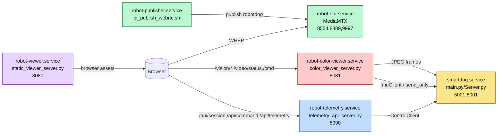

# Vision + Command System Overview (Autonomy Preparation)

Last Generated: 2026-02-11 20:52 CST

Doc Version: v1.0.0 (2026-02-11 20:52 local time)

Revision History
- 2026-02-11 20:52 v1.0.0  Initial code-derived contract for vision APIs, command/session APIs, telemetry schema, ownership/safety controls, and motion execution pipeline.

--------------------------------------------------------------------------------

## 1. System Runtime Topology

### `smartdog.service`
- Purpose: runs core robot server (`Server/main.py -tn`) which instantiates `Server.Server` and owns TCP control/video ports.
- Port number:
  - `5001` control/telemetry command socket (`Server/Server.py:753`)
  - `8001` proprietary length-prefixed JPEG stream (`Server/Server.py:537`)
- Dependencies:
  - Hardware modules: Servo/IMU/ADC/Buzzer/Ultrasonic (`Server/Server.py:106-114`)
  - Internal `Control` thread (`self.control.Thread_conditiona.start()`, `Server/Server.py:189`)
- Can issue motor commands: Yes (directly sets `Control.order`, `Server/Server.py:258`).
- Read-only: No.

### `robot-telemetry.service`
- Purpose: HTTP API for telemetry + session + command + diagnostics (`Server/telemetry_api_server.py`).
- Port number: `8090` (`robot-telemetry.service` ExecStart).
- Dependencies:
  - `After=... smartdog.service robot-sfu.service robot-publisher.service` (`Client/tools/realtime_webrtc/robot/robot-telemetry.service:7`).
  - Control socket upstream `127.0.0.1:5001` (ExecStart args).
- Can issue motor commands: Yes, via `/api/command` and session release path (`Server/telemetry_api_server.py:712`, `461-465`).
- Read-only: No.

### `robot-sfu.service`
- Purpose: MediaMTX relay for RTSP/WHEP/WebRTC distribution.
- Port number: runtime listeners include `8554` (RTSP), `8889` (WHEP), `9997` (from repo docs/runtime checks).
- Dependencies: network-online only (`Client/tools/realtime_webrtc/robot/robot-sfu.service:6-7`).
- Can issue motor commands: No.
- Read-only: Yes (stream relay).

### `robot-publisher.service`
- Purpose: publishes camera stream to SFU path `robotdog` (`pi_publish_webrtc.sh`).
- Port number: no external API; pushes to SFU (`8554` path).
- Dependencies: `After=network-online.target robot-sfu.service` (`Client/tools/realtime_webrtc/robot/pi-publisher.service:9`).
- Can issue motor commands: No.
- Read-only: Yes (video producer only).

### `robot-viewer.service`
- Purpose: serves static web viewer (`Server/web/static_viewer_server.py`).
- Port number: `8080` (`robot-viewer.service` ExecStart).
- Dependencies: `After=... robot-sfu.service` (`Client/tools/realtime_webrtc/robot/robot-viewer.service:8`).
- Can issue motor commands: Not by itself (static host only); browser JS then calls `8090` APIs.
- Read-only: Server process itself is read-only/static.

### `robot-color-viewer.service` (vision worker)
- Purpose: hosts color-viewer runtime and vision worker APIs (`/vision/state`, `/vision/metrics`, `/vision/config`, `/cmd`, `/video/status`) from `color_viewer_server.py`.
- Port number: benchmark and docs target `8081` (`Server/phaseD_benchmark_1hz.sh:20`; `Server/README.md` color-viewer section).
- Dependencies:
  - Requires Pi control socket (`5001`) and video socket (`8001`) to function (`Client/tools/imu_viewer/color_viewer_server.py` defaults and worker connect path).
- Can issue motor commands: Yes via `/cmd` passthrough (`Client/tools/imu_viewer/color_viewer_server.py:1786-1811`).
- Read-only: No (`/cmd` and `/demo` are write paths).
- Note: service unit file is referenced (`robot-color-viewer.service`, `Server/phaseD_benchmark_1hz.sh:162`) but unit definition is not present in this repo snapshot.



--------------------------------------------------------------------------------

## 2. Vision State API

Endpoints found in code (`Client/tools/imu_viewer/color_viewer_server.py`):
- `GET/POST /vision/state`
- `GET/POST /vision/metrics`
- `GET/POST /vision/config`
- Related: `GET /video/status`, `POST /cmd`
- `/api/vision`: not implemented in current codebase (no route match found).

### Endpoint Path
`/vision/state`

### HTTP Method
`GET`

### Full JSON Response Example (real fields, not placeholders)
```json
{
  "ok": true,
  "ts": 1760000000.123,
  "state": {
    "yolo_enabled": false,
    "tracking_enabled": false,
    "state": "disabled",
    "target_count": 0,
    "targets": [],
    "target_age_ms": null,
    "stale": false,
    "note": "no_target",
    "last_update_ts": 0.0,
    "det_fps": 0.0,
    "track_fps": 0.0,
    "infer_ms": 0.0,
    "health": "idle",
    "error": "",
    "model_path": "",
    "model_backend": "",
    "worker_age_s": null
  }
}
```

### Field-by-field explanation
- `ok`: handler success flag.
- `ts`: response timestamp (`time.time()`).
- `state.yolo_enabled`: runtime YOLO master toggle.
- `state.tracking_enabled`: secondary toggle; only true when YOLO is enabled (`snapshot` logic).
- `state.state`: derived state string from toggles/staleness (`disabled|detect_only|tracking|no_target|stale`).
- `state.target_count`: `1` when `target` cache exists, else `0`.
- `state.targets`: list of cached target objects (single-target model currently).
- `state.target_age_ms`: milliseconds since last target update.
- `state.stale`: true when YOLO enabled and `target_age_ms > 1500` (`VisionStateManager.snapshot`).
- `state.note`: target update note (`detector_live`, `cleared`, etc.).
- `state.last_update_ts`: last target update `time.time()`.
- `state.det_fps`: detection rate measured on inference passes.
- `state.track_fps`: frame ingestion rate from port `8001`.
- `state.infer_ms`: last inference duration.
- `state.health`: worker health string (`idle|ok|degraded|error`).
- `state.error`: last worker error string.
- `state.model_path`: loaded model absolute path.
- `state.model_backend`: `ultralytics` or `onnxruntime` or `onnx-dnn`.
- `state.worker_age_s`: seconds since last worker stat update.

Target representation:
- `targets[].bbox` is normalized `[x, y, w, h]` in image fraction units (`0..1`), produced in `_pick_best_target` and ONNX parsers.
- Not pixel coordinates in API response.

### Endpoint Path
`/vision/state`

### HTTP Method
`POST`

### Full JSON Response Example (real fields, not placeholders)
```json
{
  "ok": true,
  "ts": 1760000005.321,
  "state": {
    "yolo_enabled": true,
    "tracking_enabled": false,
    "state": "no_target",
    "target_count": 0,
    "targets": [],
    "target_age_ms": null,
    "stale": false,
    "note": "worker_yolo_disabled",
    "last_update_ts": 1760000005.3,
    "det_fps": 0.0,
    "track_fps": 0.0,
    "infer_ms": 0.0,
    "health": "ok",
    "error": "",
    "model_path": "/home/pi/.../best.pt",
    "model_backend": "ultralytics",
    "worker_age_s": 0.1
  }
}
```

### Field-by-field explanation
- Same response schema as `GET`.
- Accepted actions (`action` field in request body):
  - `toggle_yolo`
  - `toggle_tracking`
  - `target_update`
  - `clear_target`
- Side effects:
  - turning YOLO off also forces `tracking_enabled=false` and clears target.
  - toggling tracking may auto-enable YOLO when currently disabled.

### Endpoint Path
`/vision/metrics`

### HTTP Method
`GET`

### Full JSON Response Example (real fields, not placeholders)
```json
{
  "ok": true,
  "ts": 1760000010.555,
  "metrics": {
    "client_stream_fps": 21.8,
    "client_stream_mode": "webrtc",
    "client_metric_age_s": 0.4,
    "min_stream_fps": 20.0,
    "kpi_status": "PASS",
    "imgsz": 320,
    "interval_n": 5,
    "auto_degrade": true,
    "yolo_enabled": true,
    "tracking_enabled": false,
    "last_throttle_action": "hold_conservative",
    "last_throttle_ts": 0.0,
    "throttle_count": 0,
    "server_preferred_stream": "webrtc",
    "server_mjpeg_fps": 0.0
  }
}
```

### Field-by-field explanation
- `client_stream_fps` / `client_stream_mode`: latest client-reported stream quality (ingested via POST).
- `client_metric_age_s`: freshness of last ingested client metric.
- `min_stream_fps`: degrade governor target from config.
- `kpi_status`: computed `PASS|WARN|FAIL|unknown`.
- `imgsz`, `interval_n`, `auto_degrade`, `yolo_enabled`, `tracking_enabled`: current config snapshot.
- `last_throttle_action`, `last_throttle_ts`, `throttle_count`: auto-degrade governor history.
- `server_preferred_stream`, `server_mjpeg_fps`: sampled from `/video/status` state.

### Endpoint Path
`/vision/metrics`

### HTTP Method
`POST`

### Full JSON Response Example (real fields, not placeholders)
```json
{
  "ok": true,
  "ts": 1760000012.1,
  "metrics": {
    "client_stream_fps": 18.7,
    "client_stream_mode": "webrtc",
    "client_metric_age_s": 0.0,
    "min_stream_fps": 20.0,
    "kpi_status": "WARN",
    "imgsz": 320,
    "interval_n": 6,
    "auto_degrade": true,
    "yolo_enabled": true,
    "tracking_enabled": false,
    "last_throttle_action": "increase_n->6",
    "last_throttle_ts": 1760000012.08,
    "throttle_count": 1,
    "server_preferred_stream": "webrtc",
    "server_mjpeg_fps": 0.0
  }
}
```

### Field-by-field explanation
- POST ingests client metrics (`stream_fps`, `stream_mode`) and may change `interval_n` when auto-degrade policy triggers.
- Cooldown: 8 seconds between auto adjustments.

### Endpoint Path
`/vision/config`

### HTTP Method
`GET`

### Full JSON Response Example (real fields, not placeholders)
```json
{
  "ok": true,
  "ts": 1760000020.2,
  "config": {
    "imgsz": 320,
    "interval_n": 5,
    "min_stream_fps": 20.0,
    "auto_degrade": true,
    "yolo_enabled": false,
    "tracking_enabled": false,
    "conf_threshold": 0.15,
    "iou_threshold": 0.45,
    "yolo_model_path": "/home/pi/.../best.pt",
    "target_width": 960,
    "target_height": 540
  }
}
```

### Field-by-field explanation
- Persistent runtime knobs managed by `VisionConfigManager`.
- Persisted to disk: `vision_runtime_config.json`.

### Endpoint Path
`/vision/config`

### HTTP Method
`POST`

### Full JSON Response Example (real fields, not placeholders)
```json
{
  "ok": true,
  "ts": 1760000021.4,
  "config": {
    "imgsz": 352,
    "interval_n": 8,
    "min_stream_fps": 20.0,
    "auto_degrade": true,
    "yolo_enabled": true,
    "tracking_enabled": false,
    "conf_threshold": 0.25,
    "iou_threshold": 0.45,
    "yolo_model_path": "/home/pi/.../best.pt",
    "target_width": 960,
    "target_height": 540
  }
}
```

### Field-by-field explanation
- Validation/sanitization:
  - `imgsz`: clamped `160..640`, rounded to multiple of 32.
  - `interval_n`: clamped `1..30`.
  - `min_stream_fps`: clamped `5..60`.
  - `conf_threshold`: clamped `0.01..0.95`.
  - `iou_threshold`: clamped `0.1..0.95`.
  - booleans normalized by `_to_bool`.

Toggle behavior (`yolo_enabled`, `tracking_enabled`):
- Set by `/vision/config` POST and `/vision/state` action toggles.
- Defaults are both `false` (`VisionConfigManager.DEFAULTS`).
- Persistence: persisted to `vision_runtime_config.json` on update.

--------------------------------------------------------------------------------

## 3. Command API (Motor Control Layer)

Motor control paths currently present:
1. HTTP API layer on `8090` (`/api/command`) with ARM/rate/watchdog logic.
2. Raw HTTP passthrough on vision worker (`/cmd`) without ARM/rate/ownership API checks.
3. Core socket protocol on `5001` (`CMD_*` text commands), where ownership arbitration is enforced by `Server.py`.

### Endpoint Path
`/api/command`

### Method
`POST`

### Full JSON Request Example
```json
{
  "action": "forward"
}
```

### Full JSON Response Example
```json
{
  "ok": true,
  "action": "forward",
  "ts": 1760000100.1,
  "client_ip": "192.168.0.50",
  "armed": true,
  "arm_ttl_ms": 18432,
  "control_lock": "owned_by_mobile",
  "owner_hint": "",
  "last_busy_age_ms": null
}
```

### Error Codes (401, 409, 423, 429, etc.)
- `401 Unauthorized`
  - when `--api-token` is enabled and Authorization Bearer token is missing/wrong.
- `400 Bad Request`
  - `{"ok":false,"error":"unsupported_action"}`.
- `403 Forbidden`
  - `{"ok":false,"error":"session_not_armed",...}` for ARM-required actions.
- `409 Conflict`
  - busy owner (`CMD_BUSY#OWNER:*`) or control socket unreachable.
- `429 Too Many Requests`
  - per-IP rate limiter hit (`rate_limit_sec=0.12`), response contains `retry_after_ms`.
- `423 Locked`
  - not implemented by current code.

Action map (HTTP action -> wire command):
- `stop` -> `CMD_MOVE_STOP\n` (ARM not required)
- `relax` -> `CMD_RELAX\n` (ARM required)
- `stop_pwm` -> `CMD_STOP_PWM\n` (ARM not required)
- `forward` -> `CMD_MOVE_FORWARD#35\n` (ARM required)
- `backward` -> `CMD_MOVE_BACKWARD#35\n` (ARM required)
- `left` -> `CMD_MOVE_LEFT#35\n` (ARM required)
- `right` -> `CMD_MOVE_RIGHT#35\n` (ARM required)
- `turn_left` -> `CMD_TURN_LEFT#30\n` (ARM required)
- `turn_right` -> `CMD_TURN_RIGHT#30\n` (ARM required)
- `beep` -> sequence `CMD_BUZZER#1` then `CMD_BUZZER#0`
- `led` -> sequence `CMD_LED_MOD#1`, `CMD_LED#255#0#255#0`, `CMD_LED_MOD#0`
- `cal` -> `CMD_CALIBRATION\n`
- `balance_on` -> `CMD_BALANCE#1\n`
- `balance_off` -> `CMD_BALANCE#0\n`

Hold-style commands:
- `Server/web/webrtc_view.html` sends repeated hold action every `250 ms` while button is pressed (`startHold`).

Watchdog timeout and auto-stop:
- `CommandState._watchdog_loop` checks every `100 ms`.
- If last active motion command age > `motion_timeout_sec` (default `0.9`), sends `CMD_MOVE_STOP`.

Speed/turn caps in HTTP layer:
- Speed and turn magnitudes are fixed by API mapping (`35` linear, `30` turn); no dynamic API speed parameter.

Validation / ownership / ARM / stale-input handling:
- Validation: action must exist in `ACTION_MAP`.
- Ownership check: indirect, via `Server.py` owner arbitration result (`CMD_BUSY#OWNER:*`) from `5001`.
- ARM enforcement: required per action flag in `ACTION_MAP`.
- Stale input: handled by motion watchdog (`active_motion_ip`/`active_motion_ts` timeout).

### Endpoint Path
`/cmd`

### Method
`POST`

### Full JSON Request Example
```json
{
  "cmd": "CMD_MOVE_FORWARD#35"
}
```

### Full JSON Response Example
```json
{
  "ok": true
}
```

### Error Codes (401, 409, 423, 429, etc.)
- `400 Bad Request` when payload does not begin with `CMD_`.
- `200 OK` with `{"ok":false,"error":"..."}` when send fails.
- No built-in `401/403/409/429/423` handling in `/cmd` path.

Behavior details:
- Automatically appends newline if missing.
- Safety policy in this endpoint: stop-class commands (`CMD_RELAX`, `CMD_MOVE_STOP`, `CMD_STOP_PWM`) terminate active demo process.
- Ownership/ARM/rate-limit are not implemented in `/cmd` itself; any ownership rejection comes later from `Server.py` on the `5001` path.

### Socket interface (non-HTTP)
- Port `5001` receives line-based `CMD_*` protocol in `Server.receive_instruction`.
- Ownership guard:
  - write commands must be owner (or owner can be acquired if none/stale).
  - safety overrides always pass: `CMD_MOVE_STOP`, `CMD_RELAX`, `CMD_STOP_PWM`.
- Rejection string is exact wire response: `CMD_BUSY#OWNER:<owner>`.

--------------------------------------------------------------------------------

## 4. Ownership and Safety Model

Ownership is implemented in two layers:

1) Session/lease layer in `telemetry_api_server.py` (`/api/session`)
- Lease store: `armed_until_by_ip`.
- Lease TTL: `arm_ttl_sec` default `20.0`, minimum `5.0`.
- Renewal:
  - `POST /api/session {"armed":true}` sets `now + arm_ttl_sec`.
  - `POST /api/session {"action":"request"}` also arms.
- Expiration:
  - stale leases removed by `_gc()` whenever session/command methods run.
- Release:
  - `POST /api/session {"action":"release"}` sends `CMD_MOVE_STOP`, disarms session.
- Lock UX metadata (`control_lock`, `owner_hint`) is heuristic from recent busy/success timestamps (8-second windows), not a hard lock primitive.

2) Control-owner arbitration in `Server.py` (port `5001`)
- Owner ID: client socket `ip:port` string.
- Owner timeout: `CTRL_OWNER_TIMEOUT_SEC = 8.0`.
- Acquisition/renewal:
  - first write command from no-owner or stale-owner client becomes owner.
  - current owner write refreshes owner timestamp.
- Non-owner write result: `CMD_BUSY#OWNER:<owner>`.
- Safety override precedence: `CMD_MOVE_STOP`, `CMD_RELAX`, `CMD_STOP_PWM` bypass ownership check.

Safety state machine (derived from actual logic; no explicit enum in code):

- `IDLE`
  - Trigger: no active motion in `CommandState` and/or disarmed session.
- `OWNED`
  - Trigger: session armed (`arm_ttl_ms > 0`) and/or recent successful control for client (`control_lock=owned_by_mobile`).
- `MOVING`
  - Trigger: action in `{forward,backward,left,right,turn_left,turn_right}` sets `active_motion_ip`.
- `STALE_INPUT`
  - Trigger: `(now - active_motion_ts) > motion_timeout_sec` (`0.9s`) in watchdog.
  - Action: watchdog injects `CMD_MOVE_STOP`.
- `E_STOP`
  - Trigger: `stop` or `stop_pwm` API action (ARM not required), or raw safety command path.
  - Effect: immediate stop class command path, ownership bypass allowed at `Server.py` layer.

Command heartbeat frequency:
- Effective hold heartbeat from viewer is 4 Hz (`250ms`) which is above watchdog requirement for `0.9s` timeout.

--------------------------------------------------------------------------------

## 5. Telemetry Schema

Primary endpoint: `GET /api/telemetry` (`Server/telemetry_api_server.py:661`).

### Full JSON example
```json
{
  "ts": 1760000200.7,
  "battery": {
    "voltage": 7.41,
    "state": "normal"
  },
  "imu": {
    "roll": -1.32,
    "pitch": 2.48,
    "yaw": 176.91
  },
  "ultrasonic_cm": 39.5,
  "stream": {
    "status": "live",
    "fps": null,
    "publisher_active": true,
    "sfu_active": true,
    "rtsp_describe_ok": true
  },
  "source_health": {
    "pi_control_link": "ok",
    "age_ms": 315,
    "last_ok_ts": 1760000200.4,
    "last_error": ""
  }
}
```

### Explanation of fields
- `battery.voltage`: from `CMD_POWER` parse.
- `battery.state`: derived by thresholds:
  - `< 6.4` -> `low`
  - `< 7.2` -> `medium`
  - else `normal`
- `imu`: roll/pitch/yaw from `CMD_ATTITUDE` parse.
- `ultrasonic_cm`: from `CMD_SONIC` parse.
- `stream.status`: derived from service + RTSP checks:
  - `live` when publisher+sfu active and RTSP DESCRIBE succeeds.
  - `degraded` when SFU active but not all stream checks pass.
  - `down` when SFU inactive.
- `stream.fps`: currently always `null` in this implementation.
- `source_health.pi_control_link`: `ok` if latest poll succeeded, else `degraded`.
- `source_health.last_error`: exception/format string from latest failure.

Freshness timestamps and stale thresholds:
- Server computes `source_health.age_ms = int((now - last_ok_ts) * 1000)`.
- API itself does not publish a boolean stale flag.
- Viewer stale handling in `webrtc_view.html` treats telemetry stale when `age_ms > 1500`.

Telemetry age calculation:
- `last_ok_ts` updates only on successful parse of power+sonic+attitude in same poll cycle.
- Poll loop interval default from service args is `0.8s`.

--------------------------------------------------------------------------------

## 6. Vision Worker Internal Behavior

Implementation source: `Client/tools/imu_viewer/color_viewer_server.py` (`VisionDetectorWorker`).

Frame acquisition:
- Connects TCP to Pi `pi_host:pi_video_port` (default `8001`).
- Reads `uint32` frame length then JPEG bytes (`_read_jpeg_frame`).
- Decodes with OpenCV (`cv2.imdecode`).

YOLO run schedule:
- Worker processes every frame for `track_fps`.
- Inference runs only when `frame_count % interval_n == 0`.
- `interval_n` default is `5` from config defaults.

Default parameters (from `VisionConfigManager.DEFAULTS`):
- `imgsz=320`
- `interval_n=5`
- `min_stream_fps=20.0`
- `auto_degrade=true`
- `yolo_enabled=false`
- `tracking_enabled=false`
- `conf_threshold=0.15`
- `iou_threshold=0.45`
- `target_width=960`, `target_height=540`

Tracker used:
- No dedicated multi-object tracker implementation.
- `track_fps` is frame ingest rate metric, not a Kalman/ByteTrack/DeepSORT tracker.
- API still exposes `tracking_enabled` toggle and state flag.

Result cache:
- Cached in `VisionStateManager.target` (single target) and exposed as `targets` list (`0/1` entries).
- `target_age_ms` and staleness derived from last target update timestamp.

Latency and health fields:
- `infer_ms`: measured per inference.
- `det_fps`: detections/time ratio for inference passes.
- `health`/`error`: updated on model load, decode, infer, stream errors.

Model backend and load fallback:
- `.onnx` path:
  - try `onnxruntime` first
  - then OpenCV DNN (`onnx-dnn`)
- `.pt` path:
  - try Ultralytics; if unavailable and matching `.onnx` exists, fallback to ONNX load.

Error handling/restart behavior:
- model load fail: set health degraded/error and retry loop after `1.0s`.
- video connect fail: set degraded and retry after `1.0s`.
- stream/infer errors: set error/degraded then continue loop.
- YOLO disabled: clears target and sets health `idle`, sleeps `0.25s`.

--------------------------------------------------------------------------------

## 7. Motion Command Pipeline

Path traced from HTTP command to motor actuation:

1. Incoming HTTP command
- `POST /api/command` in `Handler.do_POST` (`Server/telemetry_api_server.py:712`).

2. Validation
- `CommandState.execute` validates `action` against `ACTION_MAP` (`:518-523`).

3. Ownership check
- API layer does not own socket lock directly.
- Ownership is enforced downstream by `Server.py` write guard (`Server/Server.py:825-831`).
- Busy rejection is parsed back as `CMD_BUSY#OWNER:*` and returned as HTTP `409`.

4. ARM check
- In `execute`, `requires_arm` actions require active session lease (`:528-533`).

5. Rate limit
- Non-stop-class actions pass `_rate_limit_ok`; default min gap `0.12s` per IP (`:389`, `487-489`).

6. Motor IO function dispatch
- `CommandState._send_control` writes wire command to `5001` via `ControlClient.send_no_reply`.
- `Server.receive_instruction` parses command and either:
  - handles immediate non-motion actions directly (LED, buzzer, sensor replies), or
  - queues control order via `_set_control_order` (`Server/Server.py:258, 890, 893, 942`).
- `Control.condition` thread executes motion primitives (`forWard`, `backWard`, `turnLeft`, `turnRight`, etc.) and servo outputs.

7. Watchdog timer
- `CommandState._watchdog_loop` checks every `0.1s` and sends `CMD_MOVE_STOP` on stale motion (`> motion_timeout_sec`).

Thread/process ownership details:
- `telemetry_api_server.py`:
  - HTTP server uses `ThreadingHTTPServer` (request threads).
  - `CommandState` has internal lock and separate watchdog thread.
  - `PollThread` updates telemetry state asynchronously.
- `Server.py`:
  - `receive_instruction` accept loop on one thread, spawns per-client handler threads.
  - Motion execution is in `Control.Thread_conditiona` background thread.

Blocking vs non-blocking:
- `/api/command` is mostly non-blocking; uses send-only socket write and short optional read.
- Motion gait functions run in control thread and can hold execution inside looped gait steps until command changes/preemption policy applies.

--------------------------------------------------------------------------------

## 8. Timing and Performance Constraints

Code-defined constraints:
- Control loop frequency:
  - No fixed Hz constant in `Control.condition`; loop is continuous and command-function dependent.
- Command RTT measurement:
  - Not explicitly recorded as RTT metric in API payload.
- Telemetry update rate:
  - Poll interval configured as `0.8s` in service ExecStart (`--poll-interval 0.8`).
  - Poll thread hard minimum `0.4s` (`PollThread`).
- Vision update rate:
  - Frame rate depends on input stream (`8001` camera sender set to 15 FPS in `Server.py` video path).
  - Detection cadence is `frame_fps / interval_n` (default `interval_n=5`).
- Watchdog timeout (ms):
  - `motion_timeout_sec=0.9` default -> `900 ms`.
- Lease TTL (ms):
  - `arm_ttl_sec=20.0` default -> `20000 ms` (min clamp `5000 ms`).
- Stale telemetry threshold (ms):
  - Viewer stale UI threshold is `1500 ms` (`webrtc_view.html` logic).
- Ownership staleness (socket owner):
  - `CTRL_OWNER_TIMEOUT_SEC=8.0` (`8000 ms`) in `Server.py`.
- Hold-stop smoothing in control loop:
  - `MOVE_HOLD_SEC=0.35` to ignore immediate STOP noise after last motion command.

--------------------------------------------------------------------------------

## 9. Known Limitations and TODOs

Search scope run for `TODO`, `FIXME`, `AUTONOMY`, `VISION`, `SAFETY`, `WATCHDOG` in runtime files.

Findings:
- No explicit `TODO`/`FIXME` markers found in the core runtime files inspected.
- `Server/Server.py:173`
  - `CTRL_SAFETY_OVERRIDE_COMMANDS` exists and is limited to stop/relax/pwm-stop.
- `Server/telemetry_api_server.py:399`, `586`
  - Watchdog exists only for API-motion path (`active_motion_ip` state in CommandState).
- `Client/tools/imu_viewer/color_viewer_server.py:1786`
  - `/cmd` direct command endpoint bypasses ARM/rate-limit/session semantics from `/api/command`.
- `Client/tools/imu_viewer/color_viewer_server.py:1036-1048`
  - `tracking_enabled` affects state reporting but no dedicated tracker implementation.
- `Server/phaseD_benchmark_1hz.sh:162`
  - Runtime references `robot-color-viewer.service`, but service unit file is not present in this repo snapshot.

--------------------------------------------------------------------------------

## 10. Autonomy Readiness Summary

Current capability and constraints from code:

- Is vision read-only?
  - Not strictly. Vision endpoints (`/vision/state`, `/vision/config`) mutate runtime vision toggles/config.
  - Vision worker itself does not directly command motors.
  - Separate `/cmd` endpoint in same service can send raw motor commands.

- Can autonomy safely emit motion?
  - Through `POST /api/command`: yes, with existing guardrails (ARM lease, rate limit, watchdog, downstream owner arbitration, safety overrides).
  - Through `/cmd`: guardrails are weaker (no ARM/rate/session checks in endpoint itself).

- What guardrails already exist?
  - ARM session lease (`/api/session`, TTL-based).
  - Per-IP rate limit (`0.12s`) on motion-class actions.
  - Motion watchdog auto-stop (`0.9s` stale timeout).
  - Socket ownership arbitration (`CMD_BUSY#OWNER:*`, 8s owner timeout).
  - Safety override precedence for stop/relax/stop_pwm.
  - Low-battery lockout/forced relax+stop_pwm path in `Server.py` battery monitor.

- What additional API or flags would be needed to implement `SEARCH_ROTATE`, `SEARCH_WANDER`, `TRACK_APPROACH`, `ARRIVED`, `LOST` without guessing?
  - Explicit, API-level autonomy mode flag (currently absent).
  - Explicit command source tagging/prioritization (human vs autonomy) in `/api/command` payload.
  - Explicit motion parameter API (speed/turn currently hardcoded in HTTP action map).
  - Explicit vision confidence/target validity contract for autonomy transitions (currently inferred from `target_count`, `stale`, `state`, `target_age_ms`).
  - Explicit arrival/lost criteria endpoints or server-side computed flags (not currently exposed).

This section documents current implementation constraints only; no autonomy policy/state design is provided here.
